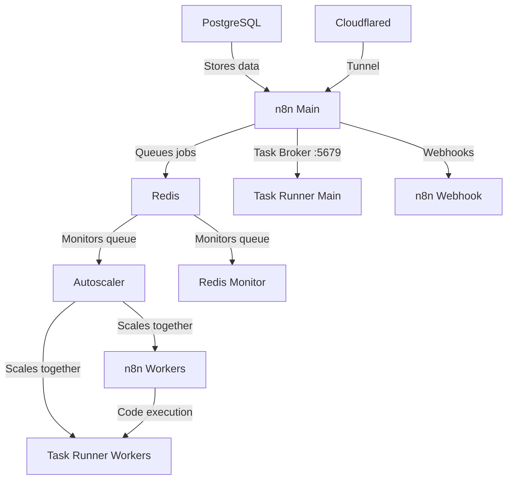

# n8n Autoscaling System (Production Ready)

A **production-grade** Docker-based autoscaling solution for n8n workflow automation platform. Dynamically scales worker containers based on Redis queue length. No need to deal with k8s or any other container scaling provider - a simple script runs it all and is easily configurable.

**Now updated for n8n 2.0** with external task runners support.

Tested with hundreds of simultaneous executions running on an 8 core 16gb ram VPS.

Includes Puppeteer and Playwright with Chromium built-in for pro level scraping from the n8n code node. Stealth plugins included for bot detection evasion.

---

## Production Security Features

The installer (v2.0.0) includes enterprise-grade security hardening:

| Feature | Description |
|---------|-------------|
| **Cloudflare Tunnel** | Required - Zero exposed ports, all traffic via encrypted tunnel |
| **SSH Hardening** | Password auth disabled, root login restricted to SSH keys only |
| **Fail2ban** | Aggressive protection - 3 failed attempts = 48-hour ban |
| **Firewall** | Only SSH (22) open, n8n accessible only via Cloudflare Tunnel |
| **Auto Updates** | Automatic security patches via unattended-upgrades |
| **Strong Passwords** | Auto-generated 32-character passwords for all services |
| **Twice-Daily Backups** | Automated backups at 3 AM and 3 PM |
| **Secure Cookies** | `N8N_SECURE_COOKIE=true` enforced |

---

## One-Line Install (Production)

SSH into your VPS and run:

```bash
curl -fsSL https://raw.githubusercontent.com/judetelan/n8n-autoscaling/main/install.sh -o install.sh
chmod +x install.sh
sudo ./install.sh
```

> **Note:** One-line piping to bash is disabled for security. Always download and review scripts before running.

### Supported Operating Systems

| OS | Versions |
|----|----------|
| Ubuntu | 20.04, 22.04, 24.04 |
| Debian | 11, 12 |
| CentOS / RHEL | 8, 9 |
| Fedora | 38+ |
| Amazon Linux | 2, 2023 |
| Alpine | 3.18+ |

### Production Requirements

| Resource | Minimum | Recommended |
|----------|---------|-------------|
| CPU | 2 cores | 4+ cores |
| RAM | 4 GB | 8+ GB |
| Disk | 40 GB | 80+ GB |

> **Note:** RAM is the primary constraint. Each worker + task runner pair uses ~500MB. With default 2-10 scaling, plan for 8GB+ RAM.

---

## DigitalOcean Deployment Guide

Complete step-by-step guide to deploy n8n autoscaling on DigitalOcean.

### Step 1: Create a DigitalOcean Account

1. Go to [digitalocean.com](https://m.do.co/c/952da1dae5ec) (referral link - get $200 free credit)
2. Sign up for an account
3. Add a payment method

### Step 2: Add Your SSH Key

This allows secure passwordless access to your server.

**On Windows (PowerShell):**
```powershell
# Generate SSH key if you don't have one
ssh-keygen -t ed25519 -C "your_email@example.com"

# View your public key
Get-Content $env:USERPROFILE\.ssh\id_ed25519.pub
```

**On Mac/Linux:**
```bash
# Generate SSH key if you don't have one
ssh-keygen -t ed25519 -C "your_email@example.com"

# View your public key
cat ~/.ssh/id_ed25519.pub
```

**Add to DigitalOcean:**
1. Go to [Settings → Security](https://cloud.digitalocean.com/account/security)
2. Click **Add SSH Key**
3. Paste your public key
4. Give it a name (e.g., "My Laptop")

### Step 3: Create a Droplet

1. Go to [Create Droplet](https://cloud.digitalocean.com/droplets/new)

2. **Choose Region:**
   - Select the datacenter closest to your users
   - Recommended: NYC, SFO, LON, or SGP

3. **Choose Image:**
   - Select **Ubuntu 24.04 (LTS) x64**

4. **Choose Size:**

   | Workload | Droplet Type | Specs | Monthly Cost |
   |----------|--------------|-------|--------------|
   | Development | Basic (Regular) | 2 vCPU, 4GB RAM, 80GB SSD | $24/mo |
   | **Production (Recommended)** | Basic (Regular) | 4 vCPU, 8GB RAM, 160GB SSD | **$48/mo** |
   | High Volume | General Purpose | 4 vCPU, 16GB RAM, 100GB SSD | $84/mo |
   | Enterprise | CPU-Optimized | 8 vCPU, 16GB RAM, 200GB SSD | $168/mo |

   **Recommendation:** For production, start with the **$48/mo plan** (8GB RAM) to handle autoscaling workers properly.

5. **Choose Authentication:**
   - Select **SSH Key**
   - Check your SSH key from Step 2

6. **Choose Hostname:**
   - Enter something memorable like `n8n-server`

7. Click **Create Droplet**

8. **Copy the IP address** once created (e.g., `143.198.123.456`)

### Step 4: Connect to Your Droplet

**On Windows (PowerShell or CMD):**
```powershell
ssh root@YOUR_DROPLET_IP
```

**On Mac/Linux:**
```bash
ssh root@YOUR_DROPLET_IP
```

Type `yes` when asked about the fingerprint.

### Step 5: Run the Installer

Once connected via SSH, run:

```bash
curl -fsSL https://raw.githubusercontent.com/judetelan/n8n-autoscaling/main/install.sh -o install.sh
chmod +x install.sh
sudo ./install.sh
```

The interactive installer will guide you through:

```
┌─────────────────────────────────────────────┐
│   n8n Autoscaling Installer v2.0.0          │
│   PRODUCTION MODE                           │
├─────────────────────────────────────────────┤
│  1) Fresh Install                           │
│  2) Update                                  │
│  3) Reconfigure                             │
│  4) Uninstall                               │
│  5) Status                                  │
│  q) Quit                                    │
└─────────────────────────────────────────────┘
```

Select **1) Fresh Install** and follow the prompts:

1. **Cloudflare Tunnel Token** - **Required** for production (see below)
2. **Domain Configuration** - Your domain for n8n (e.g., `n8n.yourdomain.com`)
3. **Webhook Domain** - Your webhook subdomain (e.g., `webhook.yourdomain.com`)
4. **Autoscaling Settings** - Configure worker limits (default: 2-10 workers)
5. **Timezone** - Set your timezone

The installer will automatically:
- Generate strong 32-character passwords for all services
- Harden SSH (disable password auth)
- Configure fail2ban with aggressive rules
- Set up automatic security updates
- Configure twice-daily backups
- Lock down firewall (only SSH open)

### Step 6: Access n8n

After installation completes:

```
https://n8n.yourdomain.com
```

> **Important:** n8n is ONLY accessible via Cloudflare Tunnel. Port 5678 is not exposed to the internet.

### Step 7: View Your Credentials

The installer saves all generated credentials to a file:

```bash
cat /opt/n8n-autoscaling/CREDENTIALS.txt
```

This file contains:
- n8n access URL
- PostgreSQL credentials
- Encryption keys
- Backup information

**Important:** Save these credentials securely, then delete the file:

```bash
rm /opt/n8n-autoscaling/CREDENTIALS.txt
```

### Step 8: Create Your First User

1. Open n8n in your browser (`https://n8n.yourdomain.com`)
2. Create your owner account
3. Start building workflows!

---

## Required: Set Up Cloudflare Tunnel

Cloudflare Tunnel is **required** for production deployment. This ensures:
- Zero exposed ports (n8n not accessible via IP:port)
- All traffic encrypted through Cloudflare's network
- DDoS protection included
- No need to manage SSL certificates

### 1. Add Domain to Cloudflare

1. Go to [Cloudflare Dashboard](https://dash.cloudflare.com/)
2. Click **Add a Site**
3. Enter your domain
4. Select **Free** plan
5. Update your domain's nameservers to Cloudflare's

### 2. Create a Tunnel (Connector)

1. Go to [Zero Trust Dashboard](https://one.dash.cloudflare.com/)
2. Navigate to **Networks → Connectors** (previously called "Tunnels")
3. Click **Create a connector**
4. Select **Cloudflared**
5. Name it (e.g., `n8n-production`)
6. **Copy the tunnel token** (starts with `eyJ...`, ~200+ characters)

### 3. Configure Public Hostname

1. In the tunnel settings, click **Public Hostname**
2. Add a hostname:
   - **Subdomain:** `n8n` (or leave blank for root)
   - **Domain:** Select your domain
   - **Service Type:** `HTTP`
   - **URL:** `n8n:5678`

3. For webhooks, add another hostname:
   - **Subdomain:** `webhook`
   - **Domain:** Select your domain
   - **Service Type:** `HTTP`
   - **URL:** `n8n-webhook:5678`

### 4. Add Token to n8n

SSH into your server and reconfigure:

```bash
./install.sh
# Select 3) Reconfigure
# Enter your Cloudflare Tunnel token when prompted
```

Or edit directly:
```bash
n8n-ctl config
# Find CLOUDFLARE_TUNNEL_TOKEN and paste your token
# Save and exit

n8n-ctl restart
```

---

## DigitalOcean Tips

### Enable Backups ($4.80/mo extra)

1. Go to your Droplet
2. Click **Backups**
3. Enable weekly backups

### Set Up Monitoring (Free)

1. Go to your Droplet
2. Click **Graphs**
3. View CPU, memory, disk, and bandwidth usage

### Enable Floating IP (Free)

Keep the same IP even if you recreate the droplet:

1. Go to **Networking → Floating IPs**
2. Assign to your droplet

### Resize Your Droplet

If you need more resources:

1. Power off the droplet
2. Click **Resize**
3. Select new plan
4. Power on

**Note:** You can only resize UP, not down.

---

## Management Commands

After installation, use the `n8n-ctl` command:

```bash
# Service Management
n8n-ctl status              # Check all service status
n8n-ctl logs                # View all logs (follow mode)
n8n-ctl logs n8n            # View specific service logs
n8n-ctl restart             # Restart all services
n8n-ctl stop                # Stop all services
n8n-ctl start               # Start all services

# Scaling
n8n-ctl scale 5             # Scale to 5 workers (and 5 task runners)

# Backups (also run automatically at 3 AM and 3 PM)
n8n-ctl backup              # Create manual backup
n8n-ctl restore             # Restore from backup

# Configuration
n8n-ctl config              # Edit .env configuration
n8n-ctl reconfigure         # Run configuration wizard

# Health & Updates
n8n-ctl health              # Check service health
n8n-ctl update              # Update to latest version
```

### Backup Location

Backups are stored in `/opt/n8n-autoscaling/backups/` and include:
- PostgreSQL database dump
- Environment configuration
- Docker volumes

---

## Manual Installation

## What's New in n8n 2.0

n8n 2.0 introduced breaking changes for task runners:
- Task runners are now **separate containers** (external mode)
- Each worker needs its own task runner sidecar
- The main n8n instance exposes a task broker on port 5679
- External packages must be configured in the task runner image

This build handles all of this automatically - the autoscaler scales both workers and their task runners together.

## Architecture Overview



### Services

| Service | Description |
|---------|-------------|
| `n8n` | Main n8n instance (editor, API) |
| `n8n-task-runner` | Task runner for main instance |
| `n8n-webhook` | Dedicated webhook processor |
| `n8n-worker` | Queue workers (autoscaled) |
| `n8n-worker-runner` | Task runners for workers (autoscaled 1:1 with workers) |
| `redis` | Job queue |
| `postgres` | Database (with pgvector) |
| `n8n-autoscaler` | Monitors queue and scales workers + runners |
| `redis-monitor` | Queue monitoring |
| `cloudflared` | Cloudflare tunnel |

## Features

- Dynamic scaling of n8n worker containers based on queue length
- **n8n 2.0 compatible** - external task runners with proper sidecar scaling
- Configurable scaling thresholds and limits
- Redis queue monitoring
- Docker Compose based deployment
- Health checks for all services
- Puppeteer and Playwright with Chromium for web scraping in Code nodes
- Stealth plugins for bot detection evasion
- External npm packages (ajv, puppeteer-core, playwright-core, etc.)
- Example workflows ready to import

## Prerequisites

- Docker and Docker Compose
- If you are a new user, I recommend either Docker Desktop or using the docker convenience script for Ubuntu
- Set up your Cloudflare domain and subdomains

## Quick Start (Manual)

If you prefer manual installation:

1. Clone this repository:
   ```bash
   git clone https://github.com/judetelan/n8n-autoscaling.git
   cd n8n-autoscaling
   ```

2. Copy the example environment file:
   ```bash
   cp .env.example .env
   ```

3. Configure your environment variables in `.env`:
   - Set strong passwords for `POSTGRES_PASSWORD`, `N8N_ENCRYPTION_KEY`, `N8N_RUNNERS_AUTH_TOKEN`
   - Update domain settings (`N8N_HOST`, `N8N_WEBHOOK`, etc.)
   - Add your `CLOUDFLARE_TUNNEL_TOKEN`
   - Optionally set `TAILSCALE_IP` for private access

4. Create the external network:
   ```bash
   docker network create shark
   ```

5. Start everything:
   ```bash
   docker compose up -d --build
   ```

## Configuration

### Key Environment Variables (Production Defaults)

| Variable | Description | Default |
|----------|-------------|---------|
| `MIN_REPLICAS` | Minimum number of worker containers | **2** |
| `MAX_REPLICAS` | Maximum number of worker containers | **10** |
| `SCALE_UP_QUEUE_THRESHOLD` | Queue length to trigger scale up | 5 |
| `SCALE_DOWN_QUEUE_THRESHOLD` | Queue length to trigger scale down | 2 |
| `POLLING_INTERVAL_SECONDS` | How often to check queue length | 15 |
| `COOLDOWN_PERIOD_SECONDS` | Time between scaling actions | 60 |

### Security Environment Variables (Auto-configured)

| Variable | Production Value | Description |
|----------|-----------------|-------------|
| `N8N_SECURE_COOKIE` | `true` | Secure cookie flag enforced |
| `N8N_BLOCK_ENV_ACCESS_IN_NODE` | `true` | Blocks env access in Code nodes |
| `N8N_DIAGNOSTICS_ENABLED` | `false` | Telemetry disabled |

### Task Runner Configuration (n8n 2.0)

| Variable | Description | Default |
|----------|-------------|---------|
| `N8N_RUNNERS_ENABLED` | Enable external task runners | true |
| `N8N_RUNNERS_MODE` | Task runner mode | external |
| `N8N_RUNNERS_AUTH_TOKEN` | Auth token for runners | (set your own) |
| `N8N_RUNNERS_MAX_CONCURRENCY` | Max concurrent tasks per runner | 5 |
| `NODE_FUNCTION_ALLOW_EXTERNAL` | Allowed npm packages in Code nodes | ajv,puppeteer-core,playwright-core,... |

### Timeout Configuration

Adjust these to be greater than your longest expected workflow execution time (in seconds):
```
N8N_QUEUE_BULL_GRACEFULSHUTDOWNTIMEOUT=300
N8N_GRACEFUL_SHUTDOWN_TIMEOUT=300
```

## Scaling Behavior

The autoscaler:
1. Monitors Redis queue length every `POLLING_INTERVAL_SECONDS`
2. Scales up when:
   - Queue length > `SCALE_UP_QUEUE_THRESHOLD`
   - Current replicas < `MAX_REPLICAS`
3. Scales down when:
   - Queue length < `SCALE_DOWN_QUEUE_THRESHOLD`
   - Current replicas > `MIN_REPLICAS`
4. Respects cooldown period between scaling actions
5. **Scales workers and task runners together** (1:1 ratio)

## Adding External Packages

The following packages are pre-installed and ready to use in Code nodes:

| Package | Description |
|---------|-------------|
| `puppeteer-core` | Browser automation (Puppeteer) |
| `puppeteer-extra` | Puppeteer with plugin support |
| `puppeteer-extra-plugin-stealth` | Bot detection evasion |
| `playwright-core` | Browser automation (Playwright) |
| `playwright-extra` | Playwright with plugin support |
| `ajv` | JSON schema validation |
| `ajv-formats` | Additional AJV formats |
| `moment` | Date/time manipulation |

### Adding More Packages

To add additional npm packages:

1. Edit `Dockerfile.runner` and add packages to the pnpm install:
   ```dockerfile
   RUN /usr/local/bin/node /usr/local/lib/node_modules/corepack/dist/corepack.js pnpm add \
       ajv \
       ajv-formats \
       puppeteer-core@22.15.0 \
       your-package-here
   ```

2. Edit `n8n-task-runners.json` and add your package to the allowlist:
   ```json
   "NODE_FUNCTION_ALLOW_EXTERNAL": "moment,ajv,ajv-formats,puppeteer-core,playwright-core,your-package-here"
   ```

3. Rebuild:
   ```bash
   docker compose build --no-cache n8n-task-runner n8n-worker-runner
   docker compose up -d
   ```

## Monitoring

The system includes:
- Redis queue monitor service (`redis-monitor`)
- Docker health checks for all services
- Detailed logging from autoscaler

View logs:
```bash
# All services
docker compose logs -f

# Specific service
docker compose logs -f n8n-autoscaler

# Task runners
docker compose logs -f n8n-task-runner n8n-worker-runner
```

## Updating

To update:
```bash
docker compose down
docker compose build --no-cache
docker compose up -d
```

## Troubleshooting

### Check container status
```bash
docker compose ps
```

### Check logs
```bash
docker compose logs [service]
```

### Verify Redis connection
```bash
docker compose exec redis redis-cli ping
```

### Check queue length
```bash
docker compose exec redis redis-cli LLEN bull:jobs:wait
```

### Task runner issues
If Code nodes fail, check task runner logs:
```bash
docker compose logs n8n-task-runner
```

Verify the task broker is accessible:
```bash
docker compose exec n8n-task-runner wget -qO- http://n8n:5679/health || echo "Not reachable"
```

### Webhook URL format
Webhooks use your Cloudflare subdomain:
```
https://webhook.yourdomain.com/webhook/your-webhook-id
```

## File Structure

```
.
├── docker-compose.yml        # Main compose file
├── Dockerfile                # Main n8n image (based on n8nio/n8n)
├── Dockerfile.runner         # Task runner image (based on n8nio/runners)
├── n8n-task-runners.json     # Task runner launcher config (security settings, allowed packages)
├── .env.example              # Example environment configuration
├── .env                      # Your configuration (git-ignored)
├── examples/                 # Example n8n workflows (Puppeteer/Playwright)
├── autoscaler/
│   ├── Dockerfile            # Autoscaler container
│   └── autoscaler.py         # Scaling logic
└── monitor/
    └── monitor.Dockerfile    # Redis monitor container
```

## Task Runner Security Configuration

The `n8n-task-runners.json` file controls security settings for the JavaScript task runner:

| Setting | Description |
|---------|-------------|
| `NODE_ENV=test` | Disables prototype freezing (required for puppeteer/playwright) |
| `NODE_FUNCTION_ALLOW_EXTERNAL` | Comma-separated list of allowed npm packages |
| `NODE_FUNCTION_ALLOW_BUILTIN` | Allowed Node.js built-in modules |
| `PUPPETEER_EXECUTABLE_PATH` | Path to chromium binary |
| `PLAYWRIGHT_CHROMIUM_EXECUTABLE_PATH` | Path to chromium binary for Playwright |

**Note:** The default config removes sandbox restrictions to allow puppeteer/playwright and libraries like AJV that use `new Function()`. If you don't need these, you can restore the original security settings from the n8nio/runners image.

## Example Workflows

The `examples/` folder contains ready-to-import n8n workflows demonstrating browser automation:

| File | Description |
|------|-------------|
| `puppeteer-screenshot.json` | Take screenshots with Puppeteer |
| `puppeteer-scrape.json` | Scrape Hacker News with Puppeteer |
| `puppeteer-stealth.json` | Bot detection evasion test |
| `playwright-screenshot.json` | Take screenshots with Playwright |
| `playwright-scrape.json` | Scrape Hacker News with Playwright |
| `playwright-pdf.json` | Generate PDFs from web pages |
| `playwright-stealth.json` | Bot detection evasion test |

Import via: **Workflows** > **Add Workflow** > **Import from File**

### Quick Example (Puppeteer)

```javascript
const puppeteer = require('puppeteer-core');

const browser = await puppeteer.launch({
  executablePath: '/usr/bin/chromium-browser',
  headless: true,
  args: ['--no-sandbox', '--disable-setuid-sandbox', '--disable-dev-shm-usage']
});

const page = await browser.newPage();
await page.goto('https://example.com');
const title = await page.title();
await browser.close();

return [{ json: { title } }];
```

### Quick Example (Playwright with Stealth)

```javascript
const { chromium } = require('playwright-extra');
const StealthPlugin = require('puppeteer-extra-plugin-stealth');

chromium.use(StealthPlugin());

const browser = await chromium.launch({
  executablePath: '/usr/bin/chromium-browser',
  headless: true,
  args: ['--no-sandbox', '--disable-setuid-sandbox', '--disable-dev-shm-usage']
});

const page = await browser.newPage();
await page.goto('https://example.com');
const title = await page.title();
await browser.close();

return [{ json: { title } }];
```

---

## Built-in Tools Guide

This n8n build includes powerful tools pre-installed. Use them in **Code nodes**.

### Available Tools

| Tool | Purpose | Binary Path |
|------|---------|-------------|
| FFmpeg | Video/audio processing | `/usr/bin/ffmpeg` |
| FFprobe | Media file analysis | `/usr/bin/ffprobe` |
| GraphicsMagick | Image processing | `/usr/bin/gm` |
| Puppeteer | Browser automation | Built-in |
| Playwright | Browser automation | Built-in |
| Chromium | Headless browser | `/usr/bin/chromium-browser` |
| Git | Version control | `/usr/bin/git` |
| cURL | HTTP requests | `/usr/bin/curl` |
| jq | JSON processing | `/usr/bin/jq` |

---

### FFmpeg Examples

**Convert video format:**
```javascript
const { execSync } = require('child_process');

// Get input from previous node (base64 or file path)
const inputPath = '/tmp/input.mp4';
const outputPath = '/tmp/output.webm';

// Convert MP4 to WebM
execSync(`ffmpeg -i ${inputPath} -c:v libvpx -c:a libvorbis ${outputPath} -y`);

return [{ json: { success: true, output: outputPath } }];
```

**Extract audio from video:**
```javascript
const { execSync } = require('child_process');

const inputVideo = '/tmp/video.mp4';
const outputAudio = '/tmp/audio.mp3';

// Extract audio as MP3
execSync(`ffmpeg -i ${inputVideo} -vn -acodec libmp3lame -q:a 2 ${outputAudio} -y`);

return [{ json: { success: true, audioFile: outputAudio } }];
```

**Create video thumbnail:**
```javascript
const { execSync } = require('child_process');

const inputVideo = '/tmp/video.mp4';
const thumbnail = '/tmp/thumbnail.jpg';

// Extract frame at 5 seconds
execSync(`ffmpeg -i ${inputVideo} -ss 00:00:05 -vframes 1 ${thumbnail} -y`);

return [{ json: { success: true, thumbnail } }];
```

**Get video metadata with FFprobe:**
```javascript
const { execSync } = require('child_process');

const inputVideo = '/tmp/video.mp4';

// Get JSON metadata
const output = execSync(`ffprobe -v quiet -print_format json -show_format -show_streams ${inputVideo}`);
const metadata = JSON.parse(output.toString());

return [{ json: metadata }];
```

**Compress video for web:**
```javascript
const { execSync } = require('child_process');

const input = '/tmp/large-video.mp4';
const output = '/tmp/compressed.mp4';

// Compress with H.264, CRF 28 (lower = better quality, larger file)
execSync(`ffmpeg -i ${input} -c:v libx264 -crf 28 -preset fast -c:a aac -b:a 128k ${output} -y`);

return [{ json: { success: true, compressed: output } }];
```

---

### GraphicsMagick Examples

**Resize image:**
```javascript
const { execSync } = require('child_process');

const input = '/tmp/image.jpg';
const output = '/tmp/resized.jpg';

// Resize to 800px width, maintain aspect ratio
execSync(`gm convert ${input} -resize 800x ${output}`);

return [{ json: { success: true, output } }];
```

**Create thumbnail:**
```javascript
const { execSync } = require('child_process');

const input = '/tmp/image.jpg';
const output = '/tmp/thumb.jpg';

// Create 150x150 thumbnail (cropped to fit)
execSync(`gm convert ${input} -resize 150x150^ -gravity center -extent 150x150 ${output}`);

return [{ json: { success: true, thumbnail: output } }];
```

**Convert image format:**
```javascript
const { execSync } = require('child_process');

const input = '/tmp/image.png';
const output = '/tmp/image.webp';

// Convert PNG to WebP with quality 80
execSync(`gm convert ${input} -quality 80 ${output}`);

return [{ json: { success: true, output } }];
```

**Add watermark:**
```javascript
const { execSync } = require('child_process');

const input = '/tmp/photo.jpg';
const watermark = '/tmp/watermark.png';
const output = '/tmp/watermarked.jpg';

// Composite watermark in bottom-right corner
execSync(`gm composite -gravity SouthEast -geometry +10+10 ${watermark} ${input} ${output}`);

return [{ json: { success: true, output } }];
```

---

### Puppeteer Examples

**Take full-page screenshot:**
```javascript
const puppeteer = require('puppeteer-core');

const browser = await puppeteer.launch({
  executablePath: '/usr/bin/chromium-browser',
  headless: true,
  args: ['--no-sandbox', '--disable-setuid-sandbox', '--disable-dev-shm-usage']
});

const page = await browser.newPage();
await page.setViewport({ width: 1920, height: 1080 });
await page.goto('https://example.com', { waitUntil: 'networkidle0' });

const screenshot = await page.screenshot({
  fullPage: true,
  encoding: 'base64'
});

await browser.close();

return [{ json: { screenshot: `data:image/png;base64,${screenshot}` } }];
```

**Scrape dynamic content:**
```javascript
const puppeteer = require('puppeteer-core');

const browser = await puppeteer.launch({
  executablePath: '/usr/bin/chromium-browser',
  headless: true,
  args: ['--no-sandbox', '--disable-setuid-sandbox', '--disable-dev-shm-usage']
});

const page = await browser.newPage();
await page.goto('https://news.ycombinator.com', { waitUntil: 'networkidle0' });

// Scrape headlines
const headlines = await page.evaluate(() => {
  return Array.from(document.querySelectorAll('.titleline > a')).map(a => ({
    title: a.innerText,
    url: a.href
  })).slice(0, 10);
});

await browser.close();

return headlines.map(h => ({ json: h }));
```

**Generate PDF from webpage:**
```javascript
const puppeteer = require('puppeteer-core');

const browser = await puppeteer.launch({
  executablePath: '/usr/bin/chromium-browser',
  headless: true,
  args: ['--no-sandbox', '--disable-setuid-sandbox', '--disable-dev-shm-usage']
});

const page = await browser.newPage();
await page.goto('https://example.com', { waitUntil: 'networkidle0' });

const pdf = await page.pdf({
  format: 'A4',
  printBackground: true,
  margin: { top: '1cm', right: '1cm', bottom: '1cm', left: '1cm' }
});

await browser.close();

return [{
  json: { filename: 'page.pdf' },
  binary: { data: pdf.toString('base64'), mimeType: 'application/pdf', fileName: 'page.pdf' }
}];
```

**Fill and submit form:**
```javascript
const puppeteer = require('puppeteer-core');

const browser = await puppeteer.launch({
  executablePath: '/usr/bin/chromium-browser',
  headless: true,
  args: ['--no-sandbox', '--disable-setuid-sandbox', '--disable-dev-shm-usage']
});

const page = await browser.newPage();
await page.goto('https://example.com/contact', { waitUntil: 'networkidle0' });

// Fill form fields
await page.type('#name', 'John Doe');
await page.type('#email', 'john@example.com');
await page.type('#message', 'Hello from n8n!');

// Submit and wait for navigation
await Promise.all([
  page.waitForNavigation(),
  page.click('#submit-button')
]);

const success = await page.url();
await browser.close();

return [{ json: { submitted: true, redirectedTo: success } }];
```

---

### Playwright Examples (with Stealth)

**Scrape with bot detection evasion:**
```javascript
const { chromium } = require('playwright-extra');
const StealthPlugin = require('puppeteer-extra-plugin-stealth');

chromium.use(StealthPlugin());

const browser = await chromium.launch({
  executablePath: '/usr/bin/chromium-browser',
  headless: true,
  args: ['--no-sandbox', '--disable-setuid-sandbox', '--disable-dev-shm-usage']
});

const context = await browser.newContext({
  userAgent: 'Mozilla/5.0 (Windows NT 10.0; Win64; x64) AppleWebKit/537.36'
});

const page = await context.newPage();
await page.goto('https://bot-protected-site.com');

// Your scraping logic here
const content = await page.content();

await browser.close();

return [{ json: { content } }];
```

**Handle multiple pages:**
```javascript
const { chromium } = require('playwright-extra');
const StealthPlugin = require('puppeteer-extra-plugin-stealth');

chromium.use(StealthPlugin());

const browser = await chromium.launch({
  executablePath: '/usr/bin/chromium-browser',
  headless: true,
  args: ['--no-sandbox', '--disable-setuid-sandbox', '--disable-dev-shm-usage']
});

const urls = ['https://example1.com', 'https://example2.com', 'https://example3.com'];
const results = [];

for (const url of urls) {
  const page = await browser.newPage();
  await page.goto(url, { waitUntil: 'domcontentloaded' });
  const title = await page.title();
  results.push({ url, title });
  await page.close();
}

await browser.close();

return results.map(r => ({ json: r }));
```

---

### Working with Binary Data

**Save binary from previous node:**
```javascript
const fs = require('fs');

// Get binary data from previous node
const binaryData = $input.first().binary.data;
const buffer = Buffer.from(binaryData.data, 'base64');

// Save to temp file
const tempPath = '/tmp/input-file';
fs.writeFileSync(tempPath, buffer);

return [{ json: { savedTo: tempPath } }];
```

**Return binary output:**
```javascript
const fs = require('fs');

const filePath = '/tmp/output.mp4';
const buffer = fs.readFileSync(filePath);

return [{
  json: { filename: 'output.mp4' },
  binary: {
    data: buffer.toString('base64'),
    mimeType: 'video/mp4',
    fileName: 'output.mp4'
  }
}];
```

---

### Tips for Code Nodes

1. **Always use `/tmp/`** for temporary files - it's writable
2. **Clean up temp files** after processing to save disk space
3. **Use `execSync`** for simple commands, `exec` for async
4. **Set timeouts** for long-running processes
5. **Handle errors** with try/catch blocks

```javascript
const { execSync } = require('child_process');
const fs = require('fs');

try {
  // Your processing code
  execSync('ffmpeg -i input.mp4 output.mp4 -y', { timeout: 60000 });

  // Clean up
  fs.unlinkSync('/tmp/input.mp4');

  return [{ json: { success: true } }];
} catch (error) {
  return [{ json: { success: false, error: error.message } }];
}
```

---

## License

MIT License - See [LICENSE](LICENSE) for details.

## Credits & Acknowledgments

This project is a fork of [conor-is-my-name/n8n-autoscaling](https://github.com/conor-is-my-name/n8n-autoscaling) by **Conor**.

**Original n8n Autoscaling System by Conor:**
- Docker Compose orchestration for n8n 2.0
- Queue-based autoscaling with Redis monitoring
- Worker + task runner sidecar architecture
- Puppeteer/Playwright integration with stealth plugins
- Cloudflare Tunnel support

For Conor's detailed setup guide, see his Reddit post: [Major Update to n8n-autoscaling Build](https://www.reddit.com/r/n8n/comments/1l9mi6k/major_update_to_n8nautoscaling_build_step_by_step/)

**This Fork Adds:**
- Production-ready one-command VPS installer
- Security hardening (SSH, firewall, fail2ban, auto-updates)
- `n8n-ctl` management CLI
- Automated backups
- DigitalOcean deployment guide
