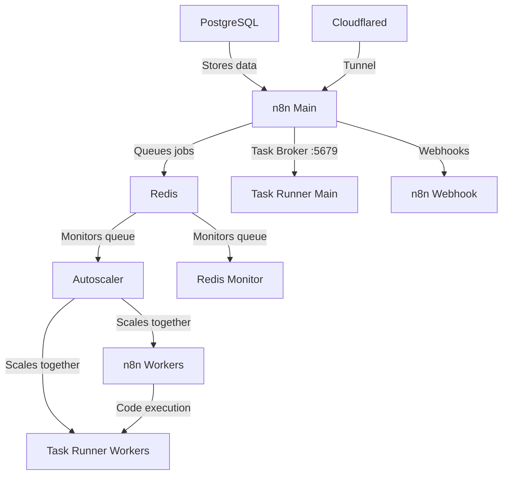

# n8n Autoscaling System (n8n 2.0 Ready)

A Docker-based autoscaling solution for n8n workflow automation platform. Dynamically scales worker containers based on Redis queue length. No need to deal with k8s or any other container scaling provider - a simple script runs it all and is easily configurable.

**Now updated for n8n 2.0** with external task runners support.

Tested with hundreds of simultaneous executions running on an 8 core 16gb ram VPS.

Includes Puppeteer and Playwright with Chromium built-in for pro level scraping from the n8n code node. Stealth plugins included for bot detection evasion.

---

## One-Line Install (Any VPS)

SSH into your VPS and run:

```bash
curl -fsSL https://raw.githubusercontent.com/judetelan/n8n-autoscaling/main/install.sh | sudo bash
```

Or for interactive mode:

```bash
curl -fsSL https://raw.githubusercontent.com/judetelan/n8n-autoscaling/main/install.sh -o install.sh
chmod +x install.sh
sudo ./install.sh
```

### Supported Operating Systems

| OS | Versions |
|----|----------|
| Ubuntu | 20.04, 22.04, 24.04 |
| Debian | 11, 12 |
| CentOS / RHEL | 8, 9 |
| Fedora | 38+ |
| Amazon Linux | 2, 2023 |
| Alpine | 3.18+ |

### Minimum Requirements

| Resource | Minimum | Recommended |
|----------|---------|-------------|
| CPU | 2 cores | 4+ cores |
| RAM | 2 GB | 4+ GB |
| Disk | 20 GB | 40+ GB |

---

## DigitalOcean Deployment Guide

Complete step-by-step guide to deploy n8n autoscaling on DigitalOcean.

### Step 1: Create a DigitalOcean Account

1. Go to [digitalocean.com](https://www.digitalocean.com/)
2. Sign up for an account (new users get $200 free credit for 60 days)
3. Add a payment method

### Step 2: Add Your SSH Key

This allows secure passwordless access to your server.

**On Windows (PowerShell):**
```powershell
# Generate SSH key if you don't have one
ssh-keygen -t ed25519 -C "your_email@example.com"

# View your public key
Get-Content $env:USERPROFILE\.ssh\id_ed25519.pub
```

**On Mac/Linux:**
```bash
# Generate SSH key if you don't have one
ssh-keygen -t ed25519 -C "your_email@example.com"

# View your public key
cat ~/.ssh/id_ed25519.pub
```

**Add to DigitalOcean:**
1. Go to [Settings → Security](https://cloud.digitalocean.com/account/security)
2. Click **Add SSH Key**
3. Paste your public key
4. Give it a name (e.g., "My Laptop")

### Step 3: Create a Droplet

1. Go to [Create Droplet](https://cloud.digitalocean.com/droplets/new)

2. **Choose Region:**
   - Select the datacenter closest to your users
   - Recommended: NYC, SFO, LON, or SGP

3. **Choose Image:**
   - Select **Ubuntu 24.04 (LTS) x64**

4. **Choose Size:**

   | Workload | Droplet Type | Specs | Monthly Cost |
   |----------|--------------|-------|--------------|
   | Testing | Basic (Regular) | 2 vCPU, 2GB RAM, 50GB SSD | $12/mo |
   | Light | Basic (Regular) | 2 vCPU, 4GB RAM, 80GB SSD | $24/mo |
   | Medium | Basic (Regular) | 4 vCPU, 8GB RAM, 160GB SSD | $48/mo |
   | Production | General Purpose | 4 vCPU, 16GB RAM, 100GB SSD | $84/mo |

   **Recommendation:** Start with the **$24/mo plan** (4GB RAM) for most use cases.

5. **Choose Authentication:**
   - Select **SSH Key**
   - Check your SSH key from Step 2

6. **Choose Hostname:**
   - Enter something memorable like `n8n-server`

7. Click **Create Droplet**

8. **Copy the IP address** once created (e.g., `143.198.123.456`)

### Step 4: Connect to Your Droplet

**On Windows (PowerShell or CMD):**
```powershell
ssh root@YOUR_DROPLET_IP
```

**On Mac/Linux:**
```bash
ssh root@YOUR_DROPLET_IP
```

Type `yes` when asked about the fingerprint.

### Step 5: Run the Installer

Once connected via SSH, run:

```bash
curl -fsSL https://raw.githubusercontent.com/judetelan/n8n-autoscaling/main/install.sh -o install.sh
chmod +x install.sh
./install.sh
```

The interactive installer will guide you through:

```
┌─────────────────────────────────────┐
│   n8n Autoscaling Installer v1.0   │
├─────────────────────────────────────┤
│  1) Fresh Install                   │
│  2) Update                          │
│  3) Reconfigure                     │
│  4) Uninstall                       │
│  5) Status                          │
│  q) Quit                            │
└─────────────────────────────────────┘
```

Select **1) Fresh Install** and follow the prompts:

1. **Domain Configuration** - Enter your domain or use IP address
2. **Cloudflare Tunnel** - Optional, for HTTPS (see below)
3. **Database Configuration** - Set PostgreSQL credentials
4. **Autoscaling Settings** - Configure worker limits
5. **Timezone** - Set your timezone

### Step 6: Access n8n

After installation completes:

**Without domain (IP only):**
```
http://YOUR_DROPLET_IP:5678
```

**With Cloudflare Tunnel:**
```
https://your-domain.com
```

### Step 7: Create Your First User

1. Open n8n in your browser
2. Create your owner account
3. Start building workflows!

---

## Optional: Set Up Cloudflare Tunnel (HTTPS)

For secure HTTPS access with a custom domain:

### 1. Add Domain to Cloudflare

1. Go to [Cloudflare Dashboard](https://dash.cloudflare.com/)
2. Click **Add a Site**
3. Enter your domain
4. Select **Free** plan
5. Update your domain's nameservers to Cloudflare's

### 2. Create a Tunnel

1. Go to [Zero Trust Dashboard](https://one.dash.cloudflare.com/)
2. Navigate to **Networks → Tunnels**
3. Click **Create a tunnel**
4. Name it (e.g., `n8n-tunnel`)
5. **Copy the tunnel token** (starts with `eyJ...`)

### 3. Configure Public Hostname

1. In the tunnel settings, click **Public Hostname**
2. Add a hostname:
   - **Subdomain:** `n8n` (or leave blank for root)
   - **Domain:** Select your domain
   - **Service Type:** `HTTP`
   - **URL:** `n8n:5678`

3. For webhooks, add another hostname:
   - **Subdomain:** `webhook`
   - **Domain:** Select your domain
   - **Service Type:** `HTTP`
   - **URL:** `n8n-webhook:5678`

### 4. Add Token to n8n

SSH into your server and reconfigure:

```bash
./install.sh
# Select 3) Reconfigure
# Enter your Cloudflare Tunnel token when prompted
```

Or edit directly:
```bash
n8n-ctl config
# Find CLOUDFLARE_TUNNEL_TOKEN and paste your token
# Save and exit

n8n-ctl restart
```

---

## DigitalOcean Tips

### Enable Backups ($4.80/mo extra)

1. Go to your Droplet
2. Click **Backups**
3. Enable weekly backups

### Set Up Monitoring (Free)

1. Go to your Droplet
2. Click **Graphs**
3. View CPU, memory, disk, and bandwidth usage

### Enable Floating IP (Free)

Keep the same IP even if you recreate the droplet:

1. Go to **Networking → Floating IPs**
2. Assign to your droplet

### Resize Your Droplet

If you need more resources:

1. Power off the droplet
2. Click **Resize**
3. Select new plan
4. Power on

**Note:** You can only resize UP, not down.

---

## Management Commands

After installation, use these commands:

```bash
n8n-ctl status    # Check service status
n8n-ctl logs      # View all logs
n8n-ctl restart   # Restart services
n8n-ctl update    # Update to latest
n8n-ctl backup    # Create backup
n8n-ctl scale 3   # Scale to 3 workers
n8n-ctl config    # Edit configuration
```

---

## Manual Installation

## What's New in n8n 2.0

n8n 2.0 introduced breaking changes for task runners:
- Task runners are now **separate containers** (external mode)
- Each worker needs its own task runner sidecar
- The main n8n instance exposes a task broker on port 5679
- External packages must be configured in the task runner image

This build handles all of this automatically - the autoscaler scales both workers and their task runners together.

## Architecture Overview



### Services

| Service | Description |
|---------|-------------|
| `n8n` | Main n8n instance (editor, API) |
| `n8n-task-runner` | Task runner for main instance |
| `n8n-webhook` | Dedicated webhook processor |
| `n8n-worker` | Queue workers (autoscaled) |
| `n8n-worker-runner` | Task runners for workers (autoscaled 1:1 with workers) |
| `redis` | Job queue |
| `postgres` | Database (with pgvector) |
| `n8n-autoscaler` | Monitors queue and scales workers + runners |
| `redis-monitor` | Queue monitoring |
| `cloudflared` | Cloudflare tunnel |

## Features

- Dynamic scaling of n8n worker containers based on queue length
- **n8n 2.0 compatible** - external task runners with proper sidecar scaling
- Configurable scaling thresholds and limits
- Redis queue monitoring
- Docker Compose based deployment
- Health checks for all services
- Puppeteer and Playwright with Chromium for web scraping in Code nodes
- Stealth plugins for bot detection evasion
- External npm packages (ajv, puppeteer-core, playwright-core, etc.)
- Example workflows ready to import

## Prerequisites

- Docker and Docker Compose
- If you are a new user, I recommend either Docker Desktop or using the docker convenience script for Ubuntu
- Set up your Cloudflare domain and subdomains

## Quick Start (Manual)

If you prefer manual installation:

1. Clone this repository:
   ```bash
   git clone https://github.com/judetelan/n8n-autoscaling.git
   cd n8n-autoscaling
   ```

2. Copy the example environment file:
   ```bash
   cp .env.example .env
   ```

3. Configure your environment variables in `.env`:
   - Set strong passwords for `POSTGRES_PASSWORD`, `N8N_ENCRYPTION_KEY`, `N8N_RUNNERS_AUTH_TOKEN`
   - Update domain settings (`N8N_HOST`, `N8N_WEBHOOK`, etc.)
   - Add your `CLOUDFLARE_TUNNEL_TOKEN`
   - Optionally set `TAILSCALE_IP` for private access

4. Create the external network:
   ```bash
   docker network create shark
   ```

5. Start everything:
   ```bash
   docker compose up -d --build
   ```

## Configuration

### Key Environment Variables

| Variable | Description | Default |
|----------|-------------|---------|
| `MIN_REPLICAS` | Minimum number of worker containers | 1 |
| `MAX_REPLICAS` | Maximum number of worker containers | 5 |
| `SCALE_UP_QUEUE_THRESHOLD` | Queue length to trigger scale up | 5 |
| `SCALE_DOWN_QUEUE_THRESHOLD` | Queue length to trigger scale down | 1 |
| `POLLING_INTERVAL_SECONDS` | How often to check queue length | 10 |
| `COOLDOWN_PERIOD_SECONDS` | Time between scaling actions | 10 |

### Task Runner Configuration (n8n 2.0)

| Variable | Description | Default |
|----------|-------------|---------|
| `N8N_RUNNERS_ENABLED` | Enable external task runners | true |
| `N8N_RUNNERS_MODE` | Task runner mode | external |
| `N8N_RUNNERS_AUTH_TOKEN` | Auth token for runners | (set your own) |
| `N8N_RUNNERS_MAX_CONCURRENCY` | Max concurrent tasks per runner | 5 |
| `NODE_FUNCTION_ALLOW_EXTERNAL` | Allowed npm packages in Code nodes | ajv,puppeteer-core,playwright-core,... |

### Timeout Configuration

Adjust these to be greater than your longest expected workflow execution time (in seconds):
```
N8N_QUEUE_BULL_GRACEFULSHUTDOWNTIMEOUT=300
N8N_GRACEFUL_SHUTDOWN_TIMEOUT=300
```

## Scaling Behavior

The autoscaler:
1. Monitors Redis queue length every `POLLING_INTERVAL_SECONDS`
2. Scales up when:
   - Queue length > `SCALE_UP_QUEUE_THRESHOLD`
   - Current replicas < `MAX_REPLICAS`
3. Scales down when:
   - Queue length < `SCALE_DOWN_QUEUE_THRESHOLD`
   - Current replicas > `MIN_REPLICAS`
4. Respects cooldown period between scaling actions
5. **Scales workers and task runners together** (1:1 ratio)

## Adding External Packages

The following packages are pre-installed and ready to use in Code nodes:

| Package | Description |
|---------|-------------|
| `puppeteer-core` | Browser automation (Puppeteer) |
| `puppeteer-extra` | Puppeteer with plugin support |
| `puppeteer-extra-plugin-stealth` | Bot detection evasion |
| `playwright-core` | Browser automation (Playwright) |
| `playwright-extra` | Playwright with plugin support |
| `ajv` | JSON schema validation |
| `ajv-formats` | Additional AJV formats |
| `moment` | Date/time manipulation |

### Adding More Packages

To add additional npm packages:

1. Edit `Dockerfile.runner` and add packages to the pnpm install:
   ```dockerfile
   RUN /usr/local/bin/node /usr/local/lib/node_modules/corepack/dist/corepack.js pnpm add \
       ajv \
       ajv-formats \
       puppeteer-core@22.15.0 \
       your-package-here
   ```

2. Edit `n8n-task-runners.json` and add your package to the allowlist:
   ```json
   "NODE_FUNCTION_ALLOW_EXTERNAL": "moment,ajv,ajv-formats,puppeteer-core,playwright-core,your-package-here"
   ```

3. Rebuild:
   ```bash
   docker compose build --no-cache n8n-task-runner n8n-worker-runner
   docker compose up -d
   ```

## Monitoring

The system includes:
- Redis queue monitor service (`redis-monitor`)
- Docker health checks for all services
- Detailed logging from autoscaler

View logs:
```bash
# All services
docker compose logs -f

# Specific service
docker compose logs -f n8n-autoscaler

# Task runners
docker compose logs -f n8n-task-runner n8n-worker-runner
```

## Updating

To update:
```bash
docker compose down
docker compose build --no-cache
docker compose up -d
```

## Troubleshooting

### Check container status
```bash
docker compose ps
```

### Check logs
```bash
docker compose logs [service]
```

### Verify Redis connection
```bash
docker compose exec redis redis-cli ping
```

### Check queue length
```bash
docker compose exec redis redis-cli LLEN bull:jobs:wait
```

### Task runner issues
If Code nodes fail, check task runner logs:
```bash
docker compose logs n8n-task-runner
```

Verify the task broker is accessible:
```bash
docker compose exec n8n-task-runner wget -qO- http://n8n:5679/health || echo "Not reachable"
```

### Webhook URL format
Webhooks use your Cloudflare subdomain:
```
https://webhook.yourdomain.com/webhook/your-webhook-id
```

## File Structure

```
.
├── docker-compose.yml        # Main compose file
├── Dockerfile                # Main n8n image (based on n8nio/n8n)
├── Dockerfile.runner         # Task runner image (based on n8nio/runners)
├── n8n-task-runners.json     # Task runner launcher config (security settings, allowed packages)
├── .env.example              # Example environment configuration
├── .env                      # Your configuration (git-ignored)
├── examples/                 # Example n8n workflows (Puppeteer/Playwright)
├── autoscaler/
│   ├── Dockerfile            # Autoscaler container
│   └── autoscaler.py         # Scaling logic
└── monitor/
    └── monitor.Dockerfile    # Redis monitor container
```

## Task Runner Security Configuration

The `n8n-task-runners.json` file controls security settings for the JavaScript task runner:

| Setting | Description |
|---------|-------------|
| `NODE_ENV=test` | Disables prototype freezing (required for puppeteer/playwright) |
| `NODE_FUNCTION_ALLOW_EXTERNAL` | Comma-separated list of allowed npm packages |
| `NODE_FUNCTION_ALLOW_BUILTIN` | Allowed Node.js built-in modules |
| `PUPPETEER_EXECUTABLE_PATH` | Path to chromium binary |
| `PLAYWRIGHT_CHROMIUM_EXECUTABLE_PATH` | Path to chromium binary for Playwright |

**Note:** The default config removes sandbox restrictions to allow puppeteer/playwright and libraries like AJV that use `new Function()`. If you don't need these, you can restore the original security settings from the n8nio/runners image.

## Example Workflows

The `examples/` folder contains ready-to-import n8n workflows demonstrating browser automation:

| File | Description |
|------|-------------|
| `puppeteer-screenshot.json` | Take screenshots with Puppeteer |
| `puppeteer-scrape.json` | Scrape Hacker News with Puppeteer |
| `puppeteer-stealth.json` | Bot detection evasion test |
| `playwright-screenshot.json` | Take screenshots with Playwright |
| `playwright-scrape.json` | Scrape Hacker News with Playwright |
| `playwright-pdf.json` | Generate PDFs from web pages |
| `playwright-stealth.json` | Bot detection evasion test |

Import via: **Workflows** > **Add Workflow** > **Import from File**

### Quick Example (Puppeteer)

```javascript
const puppeteer = require('puppeteer-core');

const browser = await puppeteer.launch({
  executablePath: '/usr/bin/chromium-browser',
  headless: true,
  args: ['--no-sandbox', '--disable-setuid-sandbox', '--disable-dev-shm-usage']
});

const page = await browser.newPage();
await page.goto('https://example.com');
const title = await page.title();
await browser.close();

return [{ json: { title } }];
```

### Quick Example (Playwright with Stealth)

```javascript
const { chromium } = require('playwright-extra');
const StealthPlugin = require('puppeteer-extra-plugin-stealth');

chromium.use(StealthPlugin());

const browser = await chromium.launch({
  executablePath: '/usr/bin/chromium-browser',
  headless: true,
  args: ['--no-sandbox', '--disable-setuid-sandbox', '--disable-dev-shm-usage']
});

const page = await browser.newPage();
await page.goto('https://example.com');
const title = await page.title();
await browser.close();

return [{ json: { title } }];
```

## License

MIT License - See [LICENSE](LICENSE) for details.

## Credits

For step by step instructions follow this guide: https://www.reddit.com/r/n8n/comments/1l9mi6k/major_update_to_n8nautoscaling_build_step_by_step/

Now includes Cloudflared. Configure on cloudflare.com and paste your token in the .env file.
